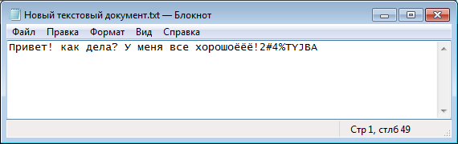
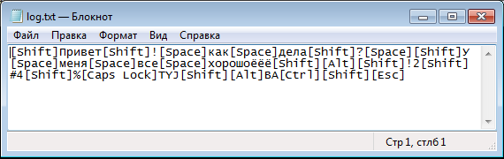

# keylogger
перехват информации, вводимой с клавиатуры

### Функционал:
- определение раскладки
- различие регистра (учитываются SHIFT и CAPSLOCK)
- системные клавиши

### Примеры:
<h4 align="center">
  
</h4>
<h4 align="center">
  
</h4>
